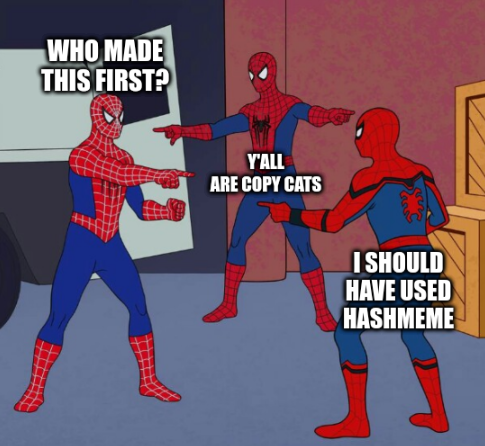

# hashmeme

It's the year 2099 and historians are debating who first published this and that meme.

If only there was a system that could trace origins of memes...

Introducing `HashMeme`, a tool for keeping an immutable logs of memes using Hedera services.



# Nix Installation (optional)

This uses `nix` to get a development environment up.

This is optional but highly recommended to get up a reproducible development environment.

For more detailed instructions for your system see: https://nixos.org/download.html

```sh
make install
```

## Start nix daemon

Start a daemon in one terminal window
```sh
sudo /nix/var/nix/profiles/default/bin/nix-daemon
```

## Start a nix-shell

This is your development environment
```
nix-shell --pure
```

# Building

```sh

make build

# Check ./target for runnable
```

# Making a GUI frontend

```sh
make gui

```

```sh
# or if not using nix:
make gui-nonix
```

# Running tests

```
make tests
```

# How it works

* User saves keys locally in a `.env` file
* User provides an image path as an input.
* HashMeme creates a hash of the image.
* HashMeme also tries to detect the text with OCR.
* HashMeme sends the payload of (Author,ImageHash,TextContent)to the Hedera Consensus Service
* Any user can then look up against the HCS based against the content.

# FAQ

Some design decisions were taken that can be answered by the following:

### Why Go?
* It's simple, efficient, stable
* The UI framework can compile to native binaries across MacOS, Windows, Linux, Android, and iOS.
* ..and it's got an official SDK with Hedera.

### Why run locally?
* It's a simple implementation and your keys remain safe locally (assuming you know how to keep your local files secure).
* Maybe in the future there could be a wallet integration once that is more mature.

### Why did you choose the Hedera Consensus Service? Why not the Hedera Token Service or the Hedera File System to store memes?
* The Consensus service is a lot cheaper with predictable fees, which you can read more about it here: https://docs.hedera.com/guides/mainnet/fees#transaction-and-query-fees
* Current ownership isn't what we're solving for as with an NFT, we just care about when did this meme first appear out in the wild.
* The consensus service is a better fit when it comes to arriving to an agreement when a certain thing first appeared. In this case, it's a hash of an image with it's text content in the field.

### Ok this is silly isn't it?
* Yeah, it is mostly for the lols, but it's a proof of concept of what you can do with the consensus service.
* There is a widespread problem of misinformation and fact checking out there.
* This use case can be extended for verifying facts in the real world.

### How can this be extended?
* Native wallet integration
* Support for video formats
* Support for more image formats
* Web version